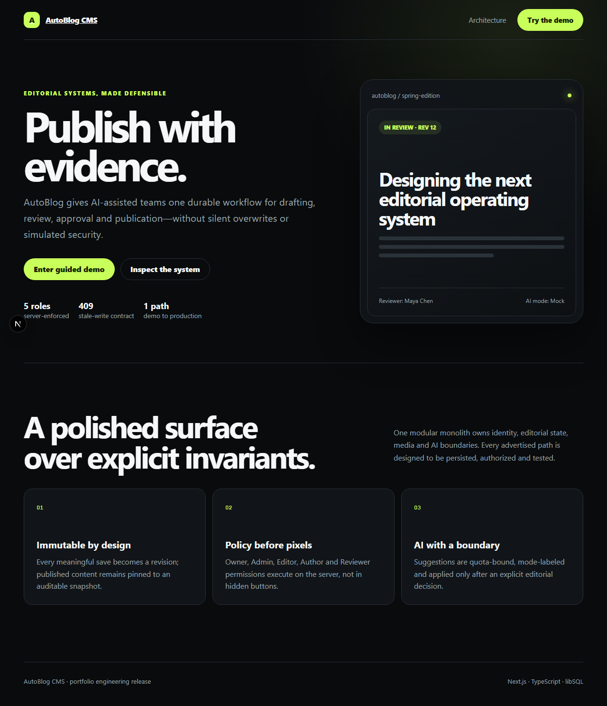
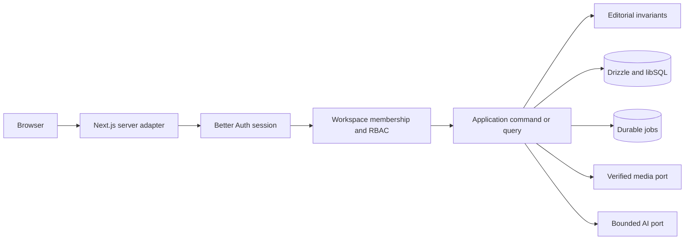
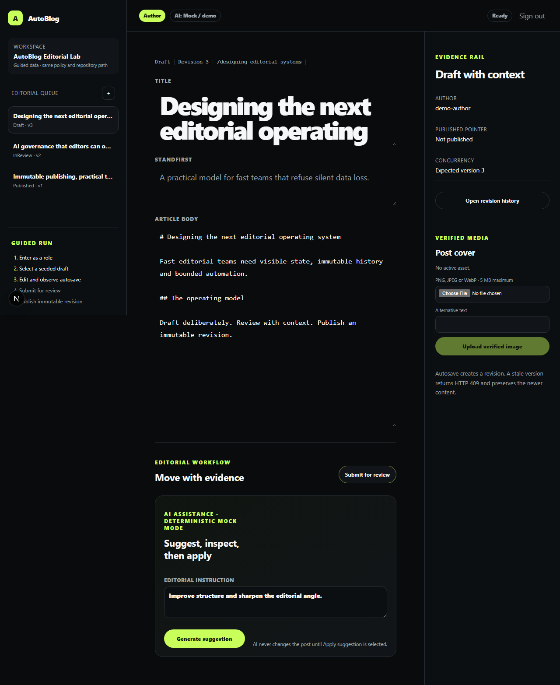

# AutoBlog CMS

An AI-assisted editorial CMS built to demonstrate durable workflow engineering: real sessions,
workspace-scoped RBAC, immutable revisions, optimistic concurrency, scheduled publication, bounded
media and explicit AI suggestions.

[](https://github.com/PatrickDev-it/AutoBlog-CMS/actions/workflows/quality.yml)
[](./LICENSE)

> AutoBlog 2.0 is release-ready in the repository, but the hosted v2 demo is not advertised yet.
> Provider credential rotation and remote libSQL/scheduler configuration remain owner actions.



## Product outcome

AutoBlog takes a post from Draft through review, approval and immutable publication. Every protected
request resolves a database session and workspace membership before invoking an application service.
Stale autosaves return HTTP 409, scheduled jobs are leased and idempotent, and generated text remains
a suggestion until a user applies it.



## Guided evaluation

1. Run the local setup below and open `http://localhost:3000/sign-in`.
2. Enter as **Author**, create a draft, edit it, reload, inspect history and submit it.
3. Sign in as **Reviewer** to request changes or approve.
4. Sign in as **Editor** to publish or schedule the pinned revision, then open public preview.
5. Request a visibly labeled mock AI suggestion and verify that content changes only after **Apply**.
6. Sign in as **Owner** to reset only the bounded demo workspace.

The application checklist derives its progress from persisted state. Seeded role buttons create
ordinary HTTP-only sessions; they are not an authentication bypass.



## Evidence-backed feature matrix

| Capability | Status | Executable evidence |
| --- | --- | --- |
| Durable workspace persistence | Implemented, tested | migration-from-empty, restart and isolation integration tests |
| Real authentication and five-role RBAC | Implemented, tested | complete policy matrix, route denials and E2E role switching |
| Immutable history, compare and restore | Implemented, tested | append-only triggers, integration tests and flagship E2E |
| Conflict-safe debounced autosave | Implemented, tested | concurrent writer integration test and HTTP 409 E2E |
| Review, scheduling and publication | Implemented, tested | state-machine tests, leased job tests and public-preview E2E |
| Bounded PNG/JPEG/WebP media | Implemented, tested | MIME/size/dimension/isolation and compensation tests |
| AI suggestions | Implemented, tested | shared mock/Gemini contract, quota/rate/timeout and explicit-Apply E2E |
| Guided resettable workspace | Demo-only, tested | Owner-only bounded reset integration and E2E |
| Analytics dashboard | Planned | no product claim or simulated analytics path |
| High-volume object storage | Planned | current adapter deliberately stores bounded objects in libSQL |
| Hosted AutoBlog 2.0 demo | Planned external gate | remote database, scheduler and historical credential rotation required |

See [FEATURES.md](./FEATURES.md) for the complete claim-to-test map.

## Local setup

Requirements: Bun 1.3.12 and Node.js 20.9 or later.

```bash
cp .env.example .env.local
bun install --frozen-lockfile
bun run db:setup
bun run dev
```

The default `.env.example` uses a durable local SQLite/libSQL file and deterministic mock AI. Do not
use a `file:` database in a serverless public deployment.

| Variable | Purpose |
| --- | --- |
| `NEXT_PUBLIC_APP_URL` | canonical origin used for cookies and origin validation |
| `DATABASE_URL` | local `file:` URL or remote `libsql:`/`https:` URL |
| `DATABASE_AUTH_TOKEN` | remote libSQL credential; omit locally |
| `BETTER_AUTH_SECRET` | unique 32+ character session secret |
| `DEMO_ENABLED` | installs and permits reset of the bounded demo workspace |
| `AI_MODE` | `mock` or `gemini` |
| `GEMINI_API_KEY`, `GEMINI_MODEL` | optional configured AI provider settings |
| `CRON_SECRET` | distinct 24+ character scheduler credential |
| `AI_MONTHLY_CHARACTER_QUOTA` | durable workspace AI character budget |
| `MEDIA_MAX_BYTES` | upload cap, constrained to at most 10 MiB |

## Quality gates

```bash
bun run typecheck
bun run lint
bun run test
bun run test:integration
bun run test:e2e
bun run test:a11y
bun run test:visual
bun run build
bun run test:performance
bun run test:lighthouse
bun run audit
bun run security:secrets
```

The measured local release evidence is 19 unit, 25 integration, 10 E2E, 6 accessibility, 5 visual,
2 direct performance tests and 6 Lighthouse runs. Current budgets and measurements are recorded in
[docs/performance.md](./docs/performance.md); these are lab targets, not universal field claims.

## Engineering documentation

- [Architecture and boundaries](./docs/architecture.md)
- [Data model and migrations](./docs/data-model.md)
- [Authentication and RBAC](./docs/authentication-rbac.md)
- [Editorial workflow](./docs/editorial-workflow.md)
- [API and stable errors](./docs/api.md)
- [Security threat model](./docs/security-threat-model.md)
- [Media security](./docs/media-security.md)
- [AI data handling](./docs/ai-data-handling.md)
- [Accessibility evidence](./docs/accessibility.md)
- [Performance evidence](./docs/performance.md)
- [Deployment](./docs/deployment.md)
- [Rollback and recovery](./docs/rollback-recovery.md)
- [Known limitations](./docs/known-limitations.md)
- [2.0 release notes](./docs/releases/v2.0.0.md)

## Security and license

Current source and runtime dependencies scan clean. An early shared commit contains historical
MongoDB, Cloudinary and Gemini values; their account owners must rotate or revoke them before public
v2 release. Values are never reproduced in documentation or fixtures. See [SECURITY.md](./SECURITY.md).

Licensed under the [MIT License](./LICENSE), copyright 2024–2026 PatrickDev-it.
