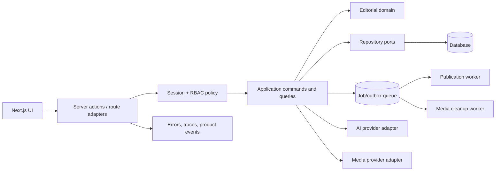

# RFC — AI-Assisted Editorial CMS

- **Status:** Proposed
- **Scope:** conversion of the current AutoBlog dashboard into a verifiable portfolio product
- **Audience:** implementation agents, frontend/full-stack reviewers, product and security reviewers
- **Decision horizon:** one stable public demo and one production-shaped application core
- **Out of scope:** Privacy organization and unrelated repositories

## 1. Executive decision

AutoBlog will become an authenticated editorial CMS with one coherent persistence path, explicit workflow
states and an intentionally designed recruiter demo. The current split between an in-memory demo adapter
and dormant MongoDB/Cloudinary routes will be removed. A feature is not considered implemented merely
because a component or route exists; it must be reachable, persisted, authorized and tested.

The product will retain its strongest asset—the visual editing surface—but reduce duplicated UI machinery,
remove unverifiable enterprise claims and prioritize a reliable editorial workflow over feature volume.

## 2. Product projection

### 2.1 Intended product

A small editorial team should be able to organize posts, edit content, review revisions, schedule
publication, manage media and request bounded AI assistance while maintaining role-based control and a
complete audit trail.

### 2.2 Portfolio role

This is the portfolio's product-engineering and full-stack project. It should demonstrate:

- polished responsive UI and accessible interaction design;
- modern React/Next.js architecture with correct server/client boundaries;
- authentication, authorization and multi-user workflows;
- durable persistence and concurrency handling;
- secure media and AI-provider integrations;
- end-to-end testing and web performance discipline;
- product analytics and evidence-driven UX decisions.

### 2.3 Success statement

A recruiter should open the public demo, enter through a documented demo account, complete a guided
draft-to-publication workflow and understand the architecture and quality evidence without configuring
private services.

## 3. Verified baseline

The current public deployment responds and presents a visually consistent dark dashboard, but its first
screen is largely empty and does not explain how to evaluate the product.

The verified engineering baseline is:

- frozen dependency installation fails because `bun.lock` and `package.json` disagree;
- typecheck produces 42 errors across 16 files;
- lint produces 57 errors and 26 warnings;
- production build succeeds only because type and lint validation are disabled;
- dependency audit reports 55 vulnerabilities, including critical and high runtime findings;
- no automated tests or project CI exist;
- most visible data flows use an in-memory `demoStore` that resets with the process;
- database, image and AI routes are not protected by real authentication;
- `.env.local` is versioned with empty values; no live secret was observed, but the convention is unsafe;
- README claims exceed the behavior demonstrably connected to the UI;
- the public repository lacks license, topics, description and Actions workflow.

## 4. Problem register and decisions

### P-01 — The application has two contradictory backends

- **Severity:** Critical
- **Evidence:** server-rendered pages call a large in-memory API simulator while MongoDB route handlers
  implement a separate persistence path.
- **Impact:** reviewers cannot determine what is real; mutations may disappear after restart.
- **Decision:** introduce one application service interface and one selected persistence implementation.
  A demo environment uses seeded durable data, not a separate behavioral codebase.
- **Acceptance:** all product flows traverse the same commands, policies and repository contracts.

### P-02 — Build configuration conceals defects

- **Severity:** Critical
- **Evidence:** `ignoreBuildErrors` and `ignoreDuringBuilds` permit deployment despite type and lint failure.
- **Impact:** a green deployment is not evidence of source quality.
- **Decision:** remove both bypasses after an explicit defect burn-down.
- **Acceptance:** typecheck, lint, tests and build are mandatory independent CI jobs.

### P-03 — Dependency state is not reproducible or secure

- **Severity:** Critical
- **Evidence:** frozen install fails; audit includes critical Next.js and high Cloudinary/Mongoose findings.
- **Impact:** clean builds and public exposure are unsafe.
- **Decision:** reconcile the lockfile, upgrade to supported patched versions and define an audit budget of
  zero unreviewed critical/high runtime vulnerabilities.
- **Acceptance:** clean frozen install and security audit pass in CI.

### P-04 — Authentication is simulated

- **Severity:** Critical
- **Evidence:** user check succeeds for any non-empty username and token; API routes have no session guard.
- **Impact:** database, media and AI operations are publicly mutable if configured.
- **Decision:** use a maintained server-side authentication system with secure cookies and explicit session
  validation on every mutation.
- **Acceptance:** anonymous and insufficient-role requests fail in route and end-to-end tests.

### P-05 — Authorization and editorial roles are undefined

- **Severity:** Critical
- **Evidence:** UI mentions members and workflow but no consistent server policy exists.
- **Impact:** the product cannot support collaborative editorial work safely.
- **Decision:** define `Owner`, `Admin`, `Editor`, `Author` and `Reviewer` capabilities. Authorization lives
  in application policies, not hidden component conditions.
- **Acceptance:** a permission matrix and negative test suite cover every command.

### P-06 — Content schema is weak and duplicated

- **Severity:** High
- **Evidence:** mixed `id`/`_id`, pervasive `any`, ad hoc post shapes and duplicated demo/API mappings.
- **Impact:** type errors, migration ambiguity and UI condition sprawl.
- **Decision:** establish canonical schemas for Workspace, User, Post, Revision, MediaAsset and Publication.
- **Acceptance:** database, API and UI use generated or shared validated types without unsafe casting.

### P-07 — Editorial workflow is presented but not modeled

- **Severity:** High
- **Evidence:** draft/scheduled/published/archived values exist without transition policy or durable jobs.
- **Impact:** invalid state changes and misleading product claims.
- **Decision:** model an explicit state machine with transition permissions, timestamps and audit events.
- **Acceptance:** illegal transitions fail and scheduled publication is idempotently executed by a worker.

### P-08 — Version control claims are unsupported

- **Severity:** High
- **Evidence:** no durable revision entity or restore operation is connected to the editor.
- **Impact:** a headline feature is non-functional.
- **Decision:** each meaningful content save produces an immutable revision; drafts track a current revision
  and restore creates another revision rather than mutating history.
- **Acceptance:** create, diff, list and restore revision flows have integration and E2E coverage.

### P-09 — Autosave lacks concurrency semantics

- **Severity:** High
- **Evidence:** local/session persistence and generic updates do not protect simultaneous editing.
- **Impact:** lost updates and false “no data loss” claims.
- **Decision:** debounce client writes, use revision/version preconditions and surface merge conflicts.
- **Acceptance:** stale update test returns conflict and UI offers reload or compare behavior.

### P-10 — Image upload boundary is unsafe and inefficient

- **Severity:** Critical
- **Evidence:** large base64 request bodies, arbitrary remote images, public-id deletion before successful
  replacement and no visible MIME/dimension policy.
- **Impact:** memory pressure, SSRF/image abuse and irreversible media loss.
- **Decision:** use signed direct upload or bounded multipart upload, validate media and finalize DB changes
  only after provider success. Destructive cleanup becomes compensating background work.
- **Acceptance:** invalid media is rejected; replacement failure preserves the existing asset.

### P-11 — AI endpoint is unauthenticated and unbounded

- **Severity:** Critical
- **Evidence:** prompt requests can reach the provider without role, quota, rate limit or usage accounting.
- **Impact:** cost abuse, provider exhaustion and prompt/data leakage.
- **Decision:** provider adapter, authenticated server command, per-workspace quota, rate limit, timeout,
  structured usage log and explicit user confirmation before applying generated content.
- **Acceptance:** AI calls expose latency/token metadata and never mutate content automatically.

### P-12 — AI product behavior is split between canned and live paths

- **Severity:** High
- **Evidence:** a large canned-response action coexists with a live provider route.
- **Impact:** demonstration can imply capabilities that are not being exercised.
- **Decision:** use one interface with explicit `demo`, `mock` and configured-provider adapters. UI must label
  the active mode.
- **Acceptance:** identical contract tests run against mock and provider adapters.

### P-13 — UI architecture contains dead and duplicated code

- **Severity:** High
- **Evidence:** missing imports, unused components, duplicated sidebar implementations and very large custom
  files coexist with generated UI primitives.
- **Impact:** reviewer navigation is slow and type debt grows.
- **Decision:** delete unreachable legacy branches, isolate generated primitives and split product features
  by domain rather than page fragment.
- **Acceptance:** no missing import, dead route or duplicate component ownership remains.

### P-14 — Accessibility claims are unverified

- **Severity:** High
- **Evidence:** README declares WCAG compliance while lint finds interaction issues and no automated or
  manual audit artifact exists.
- **Impact:** compliance language is not credible.
- **Decision:** state accessibility targets, not compliance, until axe and manual keyboard/screen-reader
  checks are stored.
- **Acceptance:** critical flows pass axe, keyboard navigation and focus-order review.

### P-15 — Performance configuration works against the framework

- **Severity:** Medium
- **Evidence:** global no-cache headers, permissive remote images and broad client-component usage reduce
  Next.js optimization value.
- **Impact:** higher JS cost and unclear caching model.
- **Decision:** define cache behavior per read model, keep authenticated editor dynamic and allow public
  preview/content to use explicit revalidation.
- **Acceptance:** Lighthouse and bundle reports establish budgets for LCP, INP, CLS and client JS.

### P-16 — Error handling leaks internal information

- **Severity:** High
- **Evidence:** generic helper returns raw error messages and logs complete stack details without a public
  error taxonomy.
- **Impact:** inconsistent status codes and potential disclosure.
- **Decision:** map domain/application errors to stable public codes and log internal details with request ID.
- **Acceptance:** API contract tests verify status, code and non-sensitive message.

### P-17 — Product onboarding is absent

- **Severity:** High
- **Evidence:** deployment opens to “select a page to edit” with limited guidance or populated navigation.
- **Impact:** recruiter may abandon the review before discovering features.
- **Decision:** add a marketing/demo entry, seeded workspace, guided checklist and reset-demo action.
- **Acceptance:** first-time reviewer completes the main flow without external instructions.

### P-18 — Repository evidence is incomplete

- **Severity:** High
- **Evidence:** no tests, CI, license, release, concise architecture or truthful feature matrix.
- **Impact:** visual polish is not supported by engineering proof.
- **Decision:** add layered tests, CI, screenshots, architecture, security notes and a live-demo badge.
- **Acceptance:** README claims map to demo steps and automated checks.

## 5. Target architecture



Recommended feature layout:

```text
app/
  (marketing)/
  (auth)/
  (workspace)/[workspaceId]/...
src/
  modules/{identity,editorial,media,ai,analytics}/
  platform/{db,auth,config,observability}/
  ui/{primitives,patterns}/
tests/{unit,integration,e2e,accessibility}/
```

## 6. Core product invariants

- Every mutable entity belongs to a workspace.
- Identity and workspace context come from the authenticated session.
- Only legal role/state combinations can execute a transition.
- Published content points to an immutable revision.
- Autosave never silently overwrites a newer revision.
- AI output is a suggestion until a user explicitly applies it.
- Media replacement cannot destroy the active asset before success.
- Demo mode uses the same domain logic as configured production mode.

## 7. What must be simplified

- Delete the 500+ line in-memory route simulator after durable seed infrastructure exists.
- Delete canned content duplicated across code; store demo fixtures as validated seed data.
- Consolidate sidebar ownership and eliminate copied primitive implementations.
- Remove Firebase remnants if Firebase is not an accepted architecture dependency.
- Remove unused “members”, analytics and workflow UI until their server behavior is real.
- Prefer a small number of feature modules over `_client`, `actions`, `utils`, `components` catch-all layers.
- Avoid micro-frontends, event streaming platforms and multi-database architecture for this scope.

## 8. Implementation plan

### Phase 0 — Security and build containment

- Upgrade vulnerable runtime dependencies.
- Reconcile and freeze lockfile.
- Fix type/lint errors and remove build bypasses.
- Replace tracked `.env.local` with `.env.example`; add secret scanning.
- Disable or guard destructive public routes until real auth exists.

**Exit gate:** frozen install, audit, typecheck, lint and build pass.

### Phase 1 — One coherent application core

- Define canonical schemas and application ports.
- Replace demoStore with seeded repository implementation.
- Add session authentication and workspace/role policies.
- Connect current UI to commands and queries through one boundary.

**Exit gate:** login, list, create and edit persist across process restart and enforce roles.

### Phase 2 — Editorial workflow

- Add revision model, optimistic concurrency and autosave.
- Add state machine, review transitions and scheduled publication worker.
- Add durable audit events and public preview.

**Exit gate:** complete author-reviewer-publication E2E flow passes.

### Phase 3 — Media and AI hardening

- Replace base64 flow with validated upload protocol.
- Add provider adapters, quotas, usage metadata and user-controlled AI application.
- Add retry/cleanup jobs and integration tests.

**Exit gate:** failure injection proves no media loss and no unbounded AI access.

### Phase 4 — Recruiter experience

- Add landing page, guided demo, reset action and seeded editorial workspace.
- Add Lighthouse, accessibility and visual regression checks.
- Publish architecture, threat model, screenshots, video and release notes.

**Exit gate:** public demo and README present the same tested feature set.

## 9. Skill projection

| Skill | Required evidence | Recruiter interpretation |
|---|---|---|
| Product engineering | guided workflow and deliberate scope | builds usable outcomes, not component collections |
| Frontend architecture | feature boundaries and server/client discipline | understands modern React beyond UI styling |
| UX/accessibility | keyboard, axe and onboarding evidence | treats usability as an engineering requirement |
| Full-stack design | shared schemas, commands and durable persistence | can own vertical features end to end |
| Security | real sessions, RBAC, safe media and AI quotas | protects costly and destructive operations |
| Data consistency | revisions, state machine and optimistic locking | handles collaborative mutation correctly |
| Testing | unit, integration, E2E, visual and accessibility | validates both behavior and experience |
| Performance | measured web-vital and bundle budgets | optimizes from evidence rather than slogans |

## 10. Definition of done

- Frozen installation and all CI gates pass.
- No build validation bypass remains.
- No unreviewed critical/high runtime vulnerability remains.
- Real session and permission checks protect every mutation.
- One durable data path serves both demo and configured environments.
- Revision, autosave conflict and publication transitions are tested.
- Media and AI integrations enforce quotas, size limits and failure compensation.
- Core flows pass Playwright and accessibility checks.
- Public demo is populated, guided and resettable.
- README feature table matches tested behavior.
- GitHub metadata, license, topics, CI and release are complete.

## 11. Agent operating contract

An implementation agent must:

1. read this RFC and map work to one or more problem IDs;
2. treat authentication and workspace context as mandatory for every mutation;
3. avoid creating a second demo-only business-logic path;
4. add a test at the lowest useful layer and an E2E test for changed flagship flows;
5. preserve existing visual identity unless the task explicitly changes product design;
6. remove dead code when replacing a path rather than retaining indefinite compatibility branches;
7. update schemas, API contracts and feature matrix together;
8. run frozen install, audit, typecheck, lint, tests and build before handoff;
9. capture screenshots or visual-regression baselines for visible changes;
10. report changes to authorization, data migration, SEO and accessibility explicitly.

Every patch handoff must include: RFC IDs addressed, user flow affected, schema/API changes, test evidence,
security impact, visual evidence, rollback/migration notes and remaining risk.

## 12. Rejected alternatives

- **Keep demoStore and Mongo routes side by side:** rejected because behavior divergence is the primary
  architecture defect.
- **Fix only lint and presentation:** rejected because authorization and persistence remain fictitious.
- **Client-only localStorage CMS:** rejected because it cannot demonstrate collaboration, workflow or
  protected integrations.
- **Add more AI features first:** rejected because the costly provider boundary is currently unprotected.
- **Split into microservices:** rejected because module and data contracts are not yet stable.

## 13. Final goal

The completed project should be perceived as the portfolio's strongest visible product: polished but not
superficial, collaborative rather than simulated, and backed by secure full-stack architecture. Its role is
to demonstrate product judgment, frontend depth and end-to-end ownership; it should not duplicate the
backend reliability narrative of the loyalty platform or the model-evaluation narrative of the ML project.
