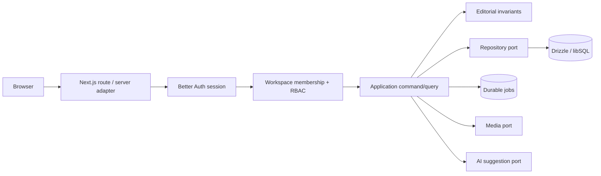

# Architecture

AutoBlog is a modular monolith. Browser code calls Next.js adapters; adapters establish a
database-backed session and workspace membership before invoking an application service. Domain
policies execute before a repository or provider. React components never import database clients.

## Ownership boundaries

- `src/modules/identity`: roles, permission matrix and workspace context.
- `src/modules/editorial`: canonical post inputs, service and repository contract.
- `src/modules/media`: verified asset storage and replacement policy.
- `src/modules/ai`: bounded suggestion adapters and usage accounting.
- `src/platform/auth`: Better Auth and origin/session adapters.
- `src/platform/db`: schema, libSQL connection, versioned migration and seed infrastructure.
- `src/platform/observability`: stable application errors and structured diagnostic logging.
- `src/ui/patterns`: client product surfaces; no database/provider imports.

The same Drizzle repository connects to a local durable `file:` URL and a remote libSQL URL. Demo
accounts and content are validated seed records, not a separate business-logic path.
