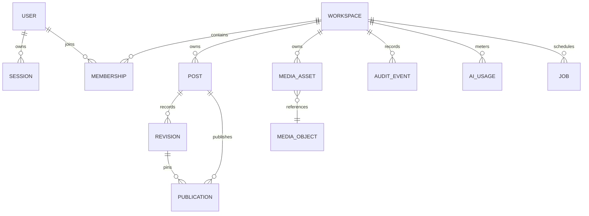

# Data model and persistence invariants

Migration `drizzle/0000_editorial_core.sql` creates the application model; later migrations add
authentication limits, media/AI governance and demo-reset idempotency. Checks, foreign keys and
uniqueness are validated from an empty database in integration tests. Operational commands and the
complete sequence are documented in [migrations.md](./migrations.md).

- Every mutable business entity has `workspace_id`; application queries filter it and relational
  constraints preserve ownership relationships.
- `revisions` are insert-only: a database trigger rejects updates. Restore creates a new row.
- `posts.version` is positive. Save inserts revision `expectedVersion + 1` and conditionally updates
  the post; a concurrent duplicate or zero-row update maps to `VERSION_CONFLICT`.
- `published_revision_id` and `publications.revision_id` point at immutable content.
- Job and publication idempotency keys are unique.
- Scheduled publications and jobs are inserted in one transaction. The payload pins the immutable
  revision, and conditional 30-second leases support recovery without duplicate publication.
- Audit events are append-only; a database trigger rejects updates.
- Migration `0002` replaces the coupled media blob table with opaque `media_objects`, constrains one
  active asset per post and adds transactional monthly AI quota windows.
- Migration `0003` adds immutable operation/idempotency records that intentionally survive the demo
  workspace cascade so a retry cannot trigger a second reset.

Migrations are checksum-verified. Changing an applied SQL file fails with
`MIGRATION_CHECKSUM_MISMATCH`; schema evolution requires a new numbered file.
