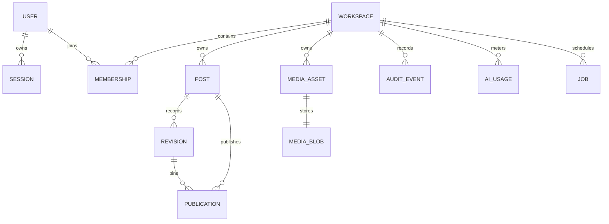

# Data model and persistence invariants

Migration `drizzle/0000_editorial_core.sql` creates the application model; migration `0001` adds
database-backed authentication rate limiting. Checks, foreign keys and uniqueness are validated
from an empty database in integration tests.

- Every mutable business entity has `workspace_id`; application queries filter it and relational
  constraints preserve ownership relationships.
- `revisions` are insert-only: a database trigger rejects updates. Restore creates a new row.
- `posts.version` is positive. Save inserts revision `expectedVersion + 1` and conditionally updates
  the post; a concurrent duplicate or zero-row update maps to `VERSION_CONFLICT`.
- `published_revision_id` and `publications.revision_id` point at immutable content.
- Job and publication idempotency keys are unique.
- Audit events are append-only; a database trigger rejects updates.

Migrations are checksum-verified. Changing an applied SQL file fails with
`MIGRATION_CHECKSUM_MISMATCH`; schema evolution requires a new numbered file.
