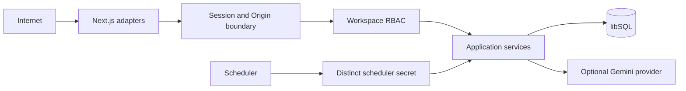

# Security and threat model

## Scope and assets

This model covers the Next.js application, Better Auth sessions, workspace content, immutable
revisions/publications, media objects, AI usage metadata, libSQL and the scheduled worker. Primary
assets are session integrity, tenant isolation, unpublished content, published-revision integrity,
provider credentials, media availability and AI quota.

## Trust boundaries

Browser payload identity is untrusted. Workspace and actor come only from the validated session.
Gemini and the deployment scheduler are external principals. Local database object storage remains
inside the application persistence boundary.

## Threats, controls and evidence

| Threat | Control | Verification | Residual risk |
| --- | --- | --- | --- |
| Session theft/fixation | HTTP-only SameSite=Lax cookie, 12-hour expiry, DB revocation, HTTPS Secure cookie | login/logout/revocation integration | compromised endpoint/browser remains outside application control |
| CSRF | trusted Origin check on custom mutations plus SameSite cookie | invalid-origin integration/E2E | upstream proxy must preserve canonical scheme/host |
| Cross-workspace access | session-derived membership, policy first, workspace-filtered repositories and FKs | negative role matrix and isolation integration | operator SQL access is privileged |
| Privilege escalation | five-role command matrix enforced in services | every role/command pair plus route denials | membership administration needs operational review |
| Lost update | expected post version and HTTP 409 | concurrent-writer integration and conflict E2E | no automatic text merge |
| Revision/publication tampering | insert-only triggers and pinned published revision | trigger, restore and later-edit tests | database owner can alter infrastructure directly |
| Upload abuse/decompression | stream byte cap, decoded type/dimension/pixel checks, no remote URL ingestion | forged MIME/size/dimension tests | malware scanning is not included |
| Media replacement loss | verify/store before atomic activation, leased compensation job | provider/finalization injection tests | prolonged worker outage delays orphan cleanup |
| AI cost/data abuse | RBAC, persistent rate/quota reservation, bounded fields/output, timeout | quota/rate/timeout/anonymous tests | SDK abort may not cancel provider billing |
| Scheduler forgery/replay | distinct constant-time secret and idempotent leased jobs | unauthorized and duplicate job tests | secret rotation requires coordinated deployment |
| Information disclosure | stable error taxonomy, request ID, structured diagnostic log | API contract tests | deployment logs remain operator-controlled |
| Dependency/secret compromise | frozen lockfile, pinned Actions, production audit and secret scans | independent CI jobs | historic provider values require owner rotation |

## Data minimization

AI usage rows retain provider/model, latency and actual count metadata; they do not retain prompts,
drafts, suggestions, raw responses or API keys. Audit events store actor/action/resource metadata, not
editorial bodies. Public preview exposes only the pinned published revision.

## Security release gate

Commit `8f83cec` contains historical MongoDB, Cloudinary and Gemini values. The current tree neither
uses nor reproduces them, but repository history is still a distribution channel. Provider account
owners must rotate/revoke all affected credentials and record completion before the v2 release. The
history scan must not be suppressed to manufacture a green build.
